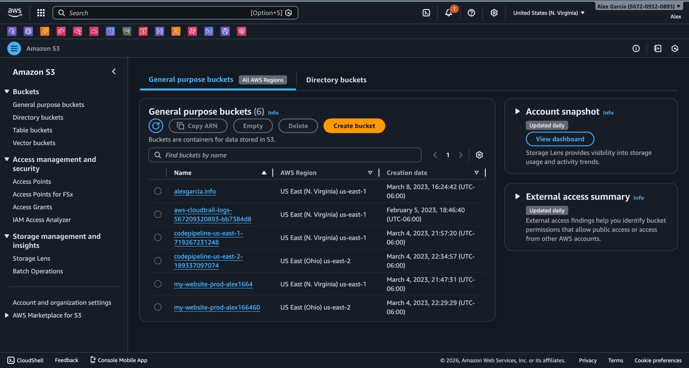
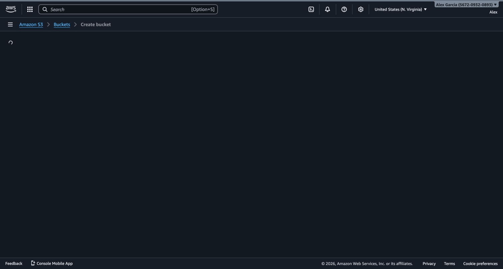
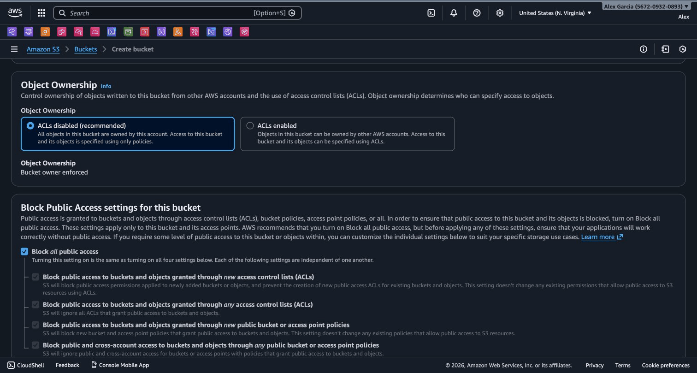
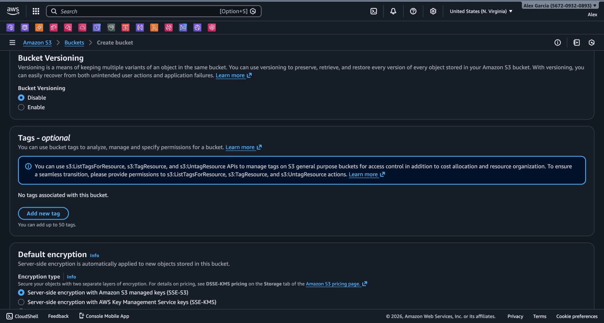
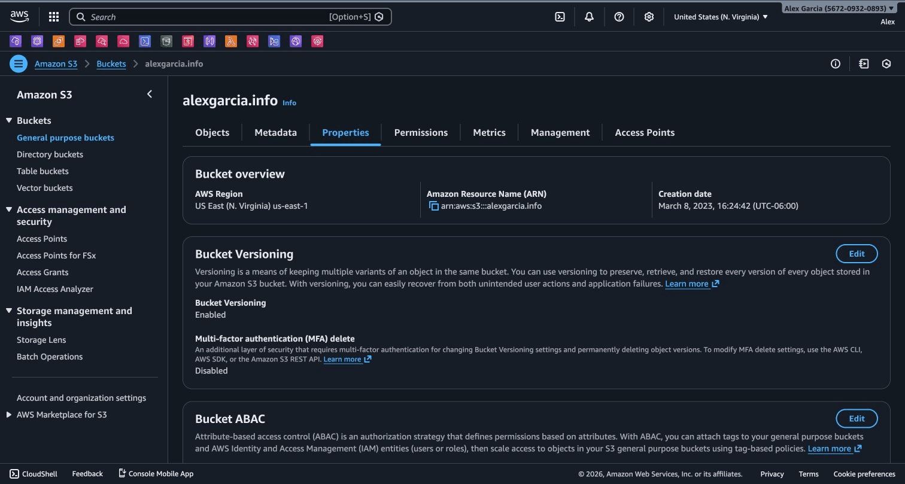
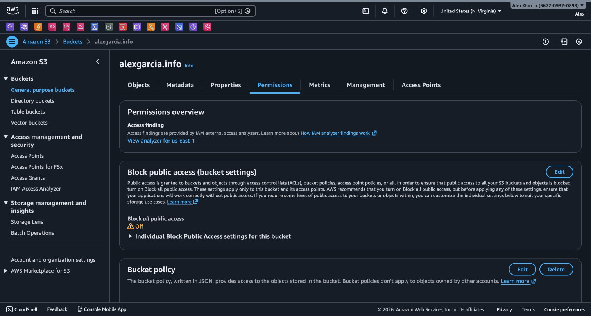

# Task 1: AWS Management Console (GUI)


## Overview

The AWS Console provides a visual, user-friendly interface for managing AWS resources. This is the best starting
point for learning AWS services.

## Step 1: Access AWS Academy Learner Lab

1. Log in to AWS Academy
2. Navigate to your course: **AWS Academy Learner Lab [155046]**
3. Click **Start Lab** to provision your temporary AWS environment
4. Wait for the lab status indicator to turn green
5. Click **AWS** to open the AWS Management Console

## Step 2: Navigate to S3

1. In the AWS Console search bar, type **S3**
2. Click on **S3** service from the results
3. You'll see the S3 dashboard with a list of buckets (if any exist)


*The S3 dashboard showing your buckets and the Create bucket button*

## Step 3: Create an S3 Bucket

1. Click the **Create bucket** button (orange)
2. Configure the following settings:

**General Configuration:**

- **Bucket name**: `an-2026-console-[your-initials]` (e.g., `an-2026-console-jag`)
  - Must be globally unique across all AWS accounts
  - Use lowercase letters, numbers, and hyphens only
- **AWS Region**: Select **US East (N. Virginia) us-east-1**


*Enter bucket name, select region, and choose General purpose bucket type*

**Object Ownership:**

- Keep **ACLs disabled (recommended)** selected

**Block Public Access:**

- Keep all checkboxes **CHECKED** (recommended for security)
- This ensures your bucket remains private


*Keep ACLs disabled and Block all public access checked*

**Bucket Versioning:**

- Select **Enable**
- Allows you to keep multiple versions of objects

**Default Encryption:**

- Select **Enable**
- Choose **Amazon S3 managed keys (SSE-S3)**


*Enable Bucket Versioning and configure default encryption with SSE-S3*

1. Click **Create bucket** at the bottom
2. Verify your bucket appears in the bucket list

## Step 4: Upload Test Files

1. Click on your bucket name to open it
2. Click **Upload** button
3. Click **Add files** and select a test file from your computer
4. Click **Upload** at the bottom
5. Verify the file appears in your bucket


*The Upload page with drag-and-drop area and Add files button*

## Step 5: Explore Bucket Properties

1. Click on the **Properties** tab
2. Review the settings:
   - Bucket Versioning: Enabled
   - Default encryption: Enabled
   - Region: us-east-1


*The Properties tab showing bucket overview, versioning, and encryption settings*

1. Click on the **Permissions** tab
2. Review the Block Public Access settings


*The Permissions tab showing Block Public Access and bucket policy settings*

## Summary

**Method**: AWS Management Console (GUI)

**Bucket Details:**

```text
Bucket Name: an-2026-console-[your-initials]
Region: us-east-1
Access: Private (public access blocked)
Versioning: Enabled
Encryption: SSE-S3 (Amazon managed)
```

## Comparison

| Aspect | Rating | Notes |
| --- | --- | --- |
| **Ease of Use** | ⭐⭐⭐⭐⭐ | Most intuitive, visual feedback |
| **Automation** | ⭐ | Manual, not repeatable |
| **Speed** | ⭐⭐ | Slow for repetitive tasks |
| **Flexibility** | ⭐⭐ | Limited to GUI options |
| **Learning Curve** | Low | No technical knowledge required |
| **Best For** | Learning | Exploration, one-off tasks |

**Advantages:**

- User-friendly visual interface
- No coding required
- Great for learning and exploration
- Immediate visual feedback
- Easy to discover features

**Disadvantages:**

- Manual and time-consuming for repetitive tasks
- Not suitable for automation
- Difficult to version control
- Human error prone
- Not reproducible

## Cleanup

To delete the bucket:

1. Go to S3 console
2. Select your bucket
3. Click **Empty** to delete all objects
4. Click **Delete** to remove the bucket

## Next Step

Continue to [Task 2: AWS CLI](./TASK-2-CLI.md)
