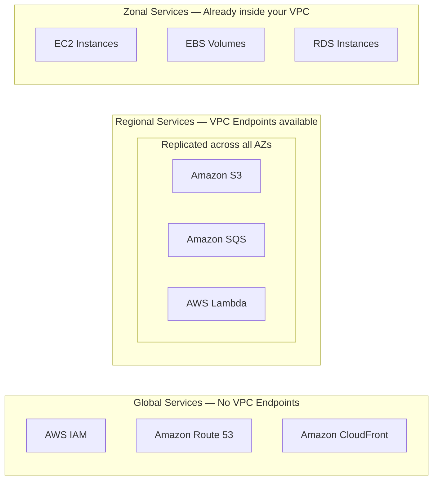
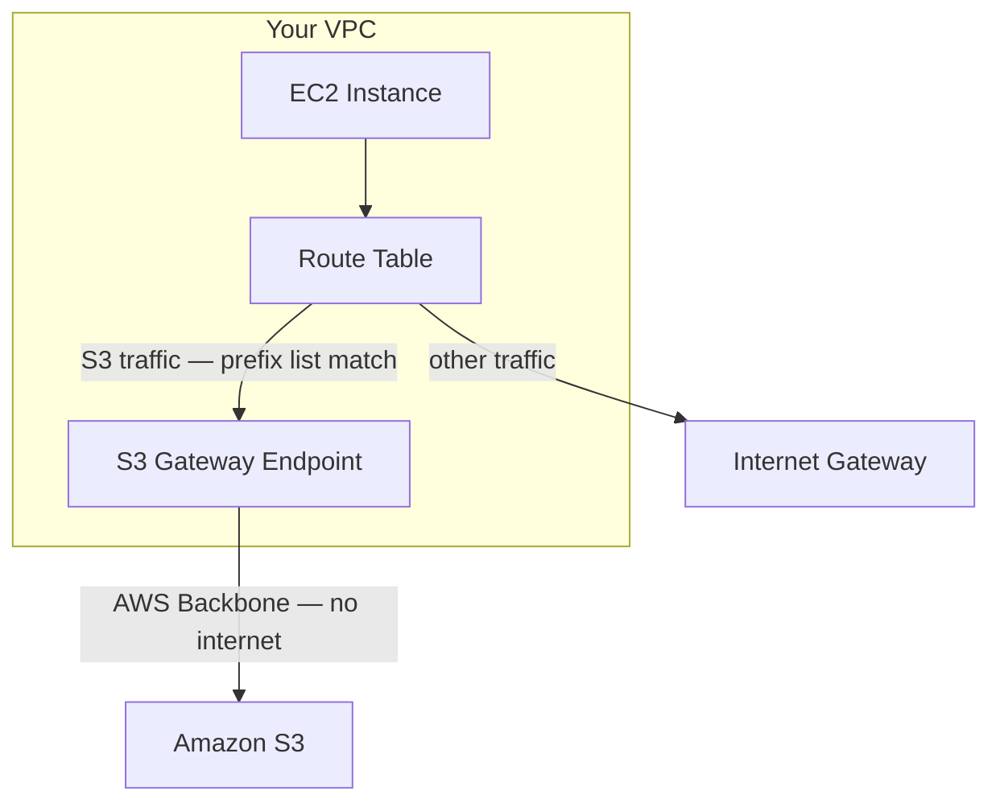
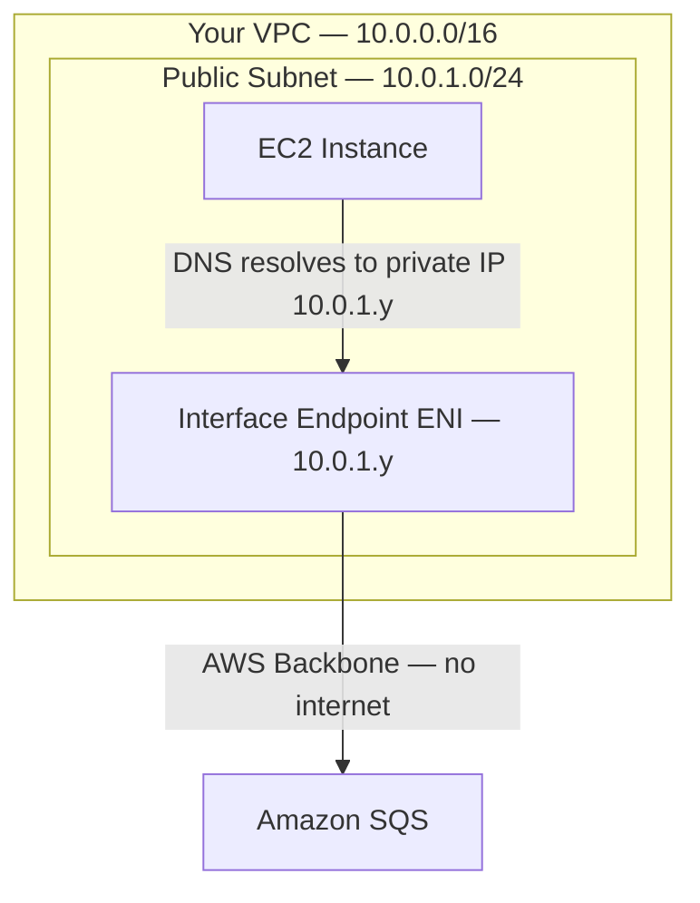
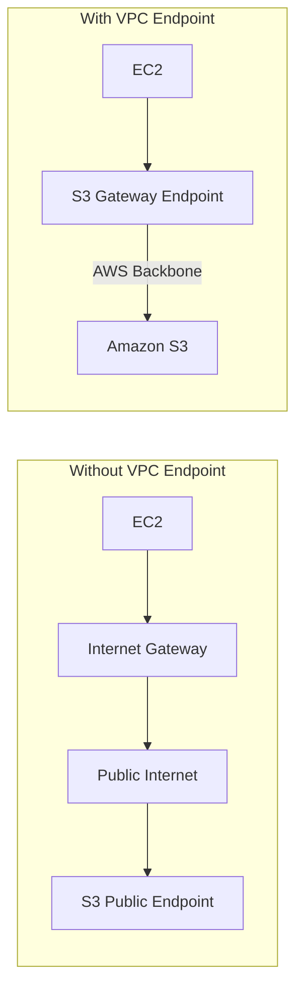
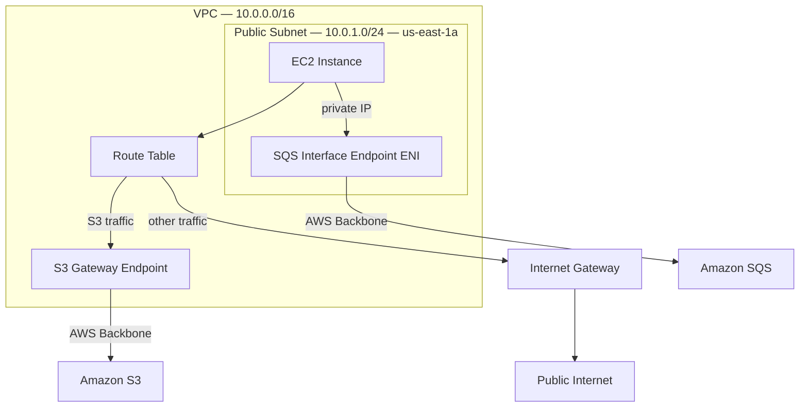
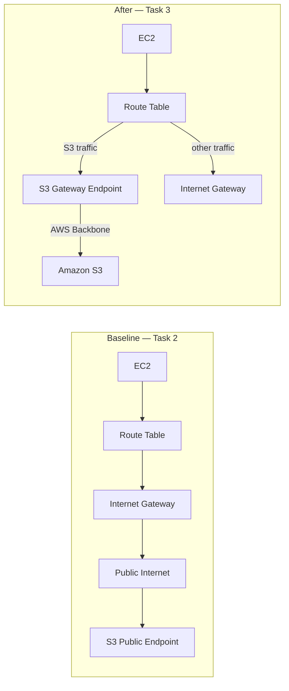
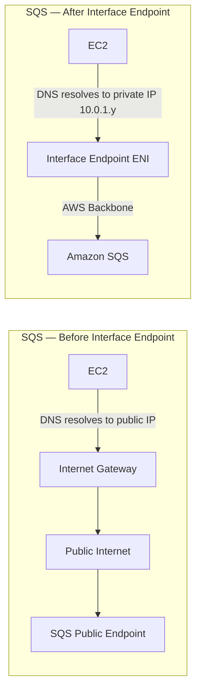

# VPC Endpoints Lab


## Overview

This lab demonstrates the difference between calling AWS services through the public internet versus calling them
through VPC endpoints — private connections that route traffic over the AWS backbone network without ever touching
the internet. You will create two types of endpoints, run DNS resolution tests, measure latency, and observe how
traffic routing changes at the network level.

By the end, you will understand not just *how* to create VPC endpoints, but *why* they exist and what problem they solve.

## Learning Objectives

- Understand the three scopes of AWS services: Global, Regional, and Zonal
- Understand the three types of VPC endpoints: Gateway, Interface (PrivateLink), and Gateway Load Balancer
- Observe how traffic routes differently with and without endpoints using DNS resolution and route
  tables
- Measure and compare latency between internet path and endpoint path
- Create a Gateway endpoint for S3 and an Interface endpoint for SQS
- Recognize the key distinction between Gateway and Interface endpoints (DNS behavior)

## Prerequisites

- Completion of Lab 01: AWS API Interaction
- Completion of Lab 02: Infrastructure as Code
- AWS Academy Learner Lab [155046] access (us-east-1)
- Terminal/command line familiarity
- Basic understanding of networking concepts (IP, DNS, routing)

---

## Part 1: Background Theory

Before touching the console, read this section carefully. Understanding the concepts here will make every
step in the lab meaningful.

---

### 1.1 AWS Service Scope Types

AWS services differ in geographic scope. They fall into three categories based on where they live.



| Scope | Examples | VPC Endpoint? | Reason |
| --- | --- | --- | --- |
| **Global** | IAM, Route 53, CloudFront, Organizations | No | These services have no regional VPC context |
| **Regional** | S3, SQS, SNS, Lambda, DynamoDB, EC2 API | Yes | These live within a region and you can reach them via a VPC endpoint |
| **Zonal** | EC2 instances, EBS volumes, RDS, ElastiCache | N/A | These already run inside your VPC or AZ — they are the resources, not endpoints to them |

> **Why does this matter?** You can only create VPC endpoints for regional services. If a student asks
> "can I create a VPC endpoint for IAM?" — the answer is no, because IAM is global and has no regional
> endpoint concept. Knowing the scope first tells you whether a VPC endpoint is even possible.

---

### 1.2 VPC Endpoint Types

VPC endpoints come in three types. This lab covers the first two in depth.

---

#### Type 1: Gateway Endpoints



- **Services covered**: Amazon S3 and Amazon DynamoDB **only**
- **Cost**: Free — no hourly charge, no data processing fee
- **Mechanism**: Adds a route to your route table pointing to a managed prefix list. No Elastic Network
  Interface (ENI).
- **DNS behavior**: **DNS does NOT change.** `s3.amazonaws.com` still resolves to a public IP. The route table
  silently redirects that traffic through the endpoint instead of the internet gateway.
- **On-premises access**: Not supported — Gateway endpoints only work from within the VPC
- **Key insight**: You do not need to change your application code or boto3 configuration. The routing change is transparent.

---

#### Type 2: Interface Endpoints (AWS PrivateLink)



- **Services covered**: 150+ AWS services — SQS, SNS, SSM, EC2 API, ECR, Secrets Manager, and more
- **Cost**: ~$0.01/hour per AZ + ~$0.01/GB of data processed
- **Mechanism**: Creates an **Elastic Network Interface (ENI)** with a private IP address inside your subnet
- **DNS behavior**: **DNS DOES change.** When you enable Private DNS, `sqs.us-east-1.amazonaws.com` resolves
  to the private IP of the ENI instead of the public IP. This is the clearest observable difference from
  Gateway endpoints.
- **On-premises access**: Supported — accessible over AWS Direct Connect or VPN
- **Key insight**: Your application keeps using the same DNS name. AWS just changes what IP that name resolves to.

---

#### Type 3: Gateway Load Balancer Endpoints

Not covered hands-on in this lab, but important to know:

- **Purpose**: Route traffic to third-party network appliances (firewalls, intrusion detection systems, packet inspectors)
- **Use case**: Insert security appliances transparently into the network path
- **Examples**: Palo Alto, Fortinet, CheckPoint deployed in AWS Marketplace

---

#### Comparison: All Three Types

| Feature | Gateway | Interface (PrivateLink) | GWLB Endpoint |
| --- | --- | --- | --- |
| **Services** | S3, DynamoDB only | 150+ AWS services | 3rd-party appliances |
| **Cost** | Free | ~$0.01/hr per AZ | Varies |
| **Creates ENI?** | No | Yes (private IP) | Yes |
| **DNS changes?** | No | Yes (private IP) | No |
| **Route table entry?** | Yes (prefix list) | No | No |
| **On-premises access** | No | Yes (Direct Connect/VPN) | No |
| **Mechanism** | Route table | Private DNS + ENI | GWLB |

---

### 1.3 Why Use VPC Endpoints At All?

Without a VPC endpoint, traffic to S3 flows through the internet:



Problems with the internet path:

1. **Security**: Traffic traverses the public internet, even though both sides are AWS
2. **Compliance**: Many regulations (PCI-DSS, HIPAA, SOC 2) require sensitive data to never leave a private network
3. **Reliability**: Public internet introduces variable latency and potential congestion points

With a VPC endpoint, traffic never leaves AWS's private network. No internet exposure.

---

## Part 2: Lab Architecture

Here is what you will build in this lab:



**Tests you will run at each stage:**

| Test | What it proves |
| --- | --- |
| **DNS resolution** (`nslookup`) | Shows whether traffic targets a public or private IP |
| **Latency** (Python script, 30 iterations) | Quantitative comparison: internet path vs endpoint path |
| **Connectivity without internet** (remove IGW route) | Proves the endpoint works without any internet access |

---

## Part 3: Tasks

---

## Task 1: Create VPC Infrastructure

You will build the network foundation manually (not with a wizard) so you understand each component.

### Step 1: Create the VPC

1. In the AWS Console, search for **VPC** and open the VPC dashboard
2. In the left menu, click **Your VPCs**
3. Click **Create VPC**
4. Configure:
   - **Resources to create**: VPC only
   - **Name tag**: `lab03-vpc`
   - **IPv4 CIDR block**: `10.0.0.0/16`
   - **IPv6 CIDR block**: No IPv6 CIDR block
   - **Tenancy**: Default
5. Click **Create VPC**

> After creation, verify that you have enabled **DNS hostnames** and **DNS resolution** — Interface
> endpoint Private DNS requires both to work.
>
> - Select `lab03-vpc` → click **Actions** → **Edit VPC settings**
> - Confirm that both **Enable DNS hostnames** and **Enable DNS resolution** have check marks
> - Save if you changed anything

---

### Step 2: Create an Internet Gateway

1. In the left menu, click **Internet gateways**
2. Click **Create internet gateway**
3. Configure:
   - **Name tag**: `lab03-igw`
4. Click **Create internet gateway**
5. After creation, click **Actions** → **Attach to VPC**
6. Select `lab03-vpc` and click **Attach internet gateway**

---

### Step 3: Create a Public Subnet

1. In the left menu, click **Subnets**
2. Click **Create subnet**
3. Configure:
   - **VPC ID**: `lab03-vpc`
   - **Subnet name**: `lab03-public-subnet`
   - **Availability Zone**: `us-east-1a`
   - **IPv4 CIDR block**: `10.0.1.0/24`
4. Click **Create subnet**

---

### Step 4: Create and Configure a Route Table

1. In the left menu, click **Route tables**
2. Click **Create route table**
3. Configure:
   - **Name**: `lab03-public-rt`
   - **VPC**: `lab03-vpc`
4. Click **Create route table**
5. Select `lab03-public-rt` → click the **Routes** tab → **Edit routes**
6. Click **Add route**:
   - **Destination**: `0.0.0.0/0`
   - **Target**: Internet Gateway → select `lab03-igw`
7. Click **Save changes**
8. Click the **Subnet associations** tab → **Edit subnet associations**
9. Check `lab03-public-subnet` → click **Save associations**

> At this point your route table should have exactly two routes:
>
> - `10.0.0.0/16 → local` (automatically added)
> - `0.0.0.0/0 → lab03-igw` (you just added this)
>
> Keep this tab open — you will return to it during Task 3 to observe what the Gateway endpoint adds.

---

## Task 2: Launch EC2 Instance and Run Baseline Tests

### Step 1: Create a Security Group for the EC2

1. In the VPC console left menu, click **Security groups**
2. Click **Create security group**
3. Configure:
   - **Security group name**: `lab03-ec2-sg`
   - **Description**: `Lab 03 - EC2 security group`
   - **VPC**: `lab03-vpc`
4. Under **Inbound rules**, click **Add rule**:
   - **Type**: SSH
   - **Source**: Anywhere-IPv4 (`0.0.0.0/0`) *(acceptable for this lab environment)*
5. Leave **Outbound rules** as default (all traffic allowed)
6. Click **Create security group**

---

### Step 2: Launch the EC2 Instance

1. Search for **EC2** and open the EC2 dashboard
2. Click **Launch instances**
3. Configure:
   - **Name**: `lab03-ec2`
   - **AMI**: Amazon Linux 2023 (64-bit x86) — from Quick Start tab
   - **Instance type**: `t2.micro`
   - **Key pair**: `vockey`
4. Under **Network settings** → **Edit**:
   - **VPC**: `lab03-vpc`
   - **Subnet**: `lab03-public-subnet`
   - **Auto-assign public IP**: Enable
   - **Security group**: Select existing → `lab03-ec2-sg`
5. Expand **Advanced details**:
   - **IAM instance profile**: `LabInstanceProfile`
6. Click **Launch instance**

Wait for the instance state to show **Running** and the status checks to show **2/2 checks passed** (~2 minutes).

---

### Step 3: Connect to the Instance

**Option A — EC2 Instance Connect (browser, easiest):**

1. Select `lab03-ec2` in the EC2 console
2. Click **Connect** → **EC2 Instance Connect** tab → **Connect**
3. A browser terminal opens

**Option B — SSH from your terminal:**

```bash
# macOS/Linux — from the directory where labsuser.pem is saved
chmod 400 labsuser.pem
ssh -i labsuser.pem ec2-user@<PUBLIC-IP-OF-EC2>
```

Replace `<PUBLIC-IP-OF-EC2>` with the public IPv4 address shown in the EC2 console.

---

### Step 4: Install Python Dependencies

Once connected to the EC2 instance, run:

```bash
# Verify Python 3 is available
python3 --version

# Install boto3
pip3 install boto3

# Verify AWS credentials from the instance profile
aws sts get-caller-identity
```

Expected output from `get-caller-identity` should show an ARN containing `LabRole`, confirming the instance
profile is working. Your script will use these credentials automatically.

---

### Step 5: Download the Lab Scripts

This lab uses three scripts — one per test type:

| Script | Test | When to run |
| --- | --- | --- |
| `dns_test.py` | DNS resolution — shows public vs private IP | Before and after each endpoint |
| `latency_test.py` | Latency benchmark — 30 iterations, avg/min/P95/max | Before and after each endpoint |
| `connectivity_test.py` | Connectivity — proves endpoint works without internet | After removing the IGW route |

```bash
# Create a working directory
mkdir ~/lab03 && cd ~/lab03

BASE="https://raw.githubusercontent.com/gamaware/cloud-architecture-course/main/03%20VPC%20Endpoints%20Lab/scripts"

curl -O "$BASE/dns_test.py"
curl -O "$BASE/latency_test.py"
curl -O "$BASE/connectivity_test.py"
```

> **Alternative** — if the URL is not available, copy and paste each file's content from the `scripts/`
> folder in the repository using `nano <filename>.py`, then `Ctrl+O`, `Enter`, `Ctrl+X`.

---

### Step 6: Run the DNS Baseline Test

Before creating any endpoints, run the DNS script to see which IPs the service names resolve to. Both should
return **PUBLIC** IPs — traffic goes through the internet.

```bash
cd ~/lab03
python3 dns_test.py
```

**Expected output (baseline — no endpoints):**

```text
  Service                        Hostname                                 Resolved IP        Scope
  ----------------------------------------------------------------------------------------------------
  S3  (Gateway endpoint)         s3.amazonaws.com                         52.216.x.x         PUBLIC
  SQS (Interface endpoint)       sqs.us-east-1.amazonaws.com              54.239.x.x         PUBLIC
```

Note these IP addresses — you will run this script again after creating each endpoint to see what changes.

---

### Step 7: Run the Latency Baseline

```bash
cd ~/lab03
python3 latency_test.py
```

Note the S3 and SQS average latency values. These are your baseline numbers — the cost of going through the public internet.

---

## Task 3: Create the S3 Gateway Endpoint



### Step 1: Create the S3 Gateway Endpoint

1. In the VPC console, click **Endpoints** in the left menu
2. Click **Create endpoint**
3. Configure:
   - **Name tag**: `lab03-s3-gateway-endpoint`
   - **Service category**: AWS services
   - **Search for service**: type `s3` and press Enter
   - From the results, select `com.amazonaws.us-east-1.s3` — confirm the **Type** column shows **Gateway**
   - **VPC**: `lab03-vpc`
   - **Route tables**: check `lab03-public-rt`
   - **Policy**: Full access
4. Click **Create endpoint**

The endpoint will reach **Available** status within seconds.

---

### Step 2: Inspect the Route Table — Key Moment

1. Go to **Route tables** → select `lab03-public-rt`
2. Click the **Routes** tab

You should now see a **third route** that was automatically added:

```text
Destination          Target
-----------          ------
10.0.0.0/16          local
0.0.0.0/0            igw-xxxxxxxxxxxxxxxxx
pl-63a5400a          vpce-xxxxxxxxxxxxxxxxx    <--- ADDED BY GATEWAY ENDPOINT
```

The destination `pl-63a5400a` is an **AWS-managed prefix list** — a dynamically maintained list of all IP
ranges used by Amazon S3 in us-east-1. You do not have to maintain this list manually; AWS keeps it updated.

When your EC2 sends traffic to any IP in that prefix list, the route table redirects it to the VPC endpoint
instead of the internet gateway.

> This is the fundamental mechanism of Gateway endpoints: **no DNS change, just a routing change.**

---

### Step 3: DNS Test — The Key Distinction

Run the DNS script again:

```bash
python3 dns_test.py
```

**Expected output — S3 still shows a PUBLIC IP:**

```text
  Service                        Hostname                                 Resolved IP        Scope
  ----------------------------------------------------------------------------------------------------
  S3  (Gateway endpoint)         s3.amazonaws.com                         52.216.x.x         PUBLIC
  SQS (Interface endpoint)       sqs.us-east-1.amazonaws.com              54.239.x.x         PUBLIC
```

This surprises many students. The endpoint is working, but DNS has not changed. Here is why:

- The EC2 makes a DNS query → gets a public IP (e.g., `52.216.x.x`)
- The EC2 tries to send a packet to `52.216.x.x`
- The route table says: "that IP is in prefix list `pl-63a5400a` → send it to the VPC endpoint"
- Traffic reaches S3 via the AWS backbone, never touching the internet

**The routing table intercepts the traffic before it leaves the VPC.** DNS resolves to a public IP, but that
IP is never actually reached over the internet — the route table entry catches it first.

---

### Step 4: Run the Latency Test Again

```bash
python3 latency_test.py
```

Note the S3 latency values and compare with your baseline. You may see a modest improvement (1-3ms is typical
within the same region). The primary benefits of the Gateway endpoint are **security** (traffic stays on AWS
backbone) and **cost**, not raw latency.

---

### Step 5: Connectivity Test — Prove S3 Works Without Internet

This is the most powerful test in the lab. You will temporarily remove the internet route from the route table
and run the connectivity script to prove that S3 still works — because it no longer needs the internet.

> **Before you start**: open two browser tabs side by side — one with your EC2 terminal, one with the
> VPC route table. You will switch between them quickly.

**In the VPC console route table tab:**

1. Go to **Route tables** → select `lab03-public-rt` → **Routes** tab
2. Click **Edit routes**
3. Delete the `0.0.0.0/0 → lab03-igw` route (click the X on that row)
4. Click **Save changes**

**Immediately switch back to your EC2 terminal and run:**

```bash
python3 connectivity_test.py
```

**Expected output:**

```text
  Test                                     Result  Detail
  ------------------------------------------------------------------------------------------
  Internet (checkip.amazonaws.com)         [!!] FAIL  <urlopen error timed out>
                                                  FAIL expected — no internet route

  Amazon S3  (list_buckets)                [OK] PASS  0 bucket(s) listed
                                                  PASS expected — Gateway endpoint bypasses internet

  Amazon SQS (list_queues)                 [!!] FAIL  ...
                                                  PASS expected — Interface endpoint bypasses internet
```

At this stage, only S3 passes — because only the S3 Gateway endpoint exists. SQS still needs the internet.
You will fix that in Task 4.

> **If your terminal session disconnects:** This can happen because removing the internet route also
> blocks return traffic for your SSH session. Do not panic — just:
>
> 1. Go to the route table and immediately re-add `0.0.0.0/0 → lab03-igw`
> 2. Reconnect via EC2 Instance Connect from the EC2 console

**Re-add the internet route before moving on:**

1. Route table → **Edit routes** → **Add route**
2. Destination: `0.0.0.0/0`, Target: Internet Gateway → `lab03-igw`
3. **Save changes**

Confirm your terminal is working again:

```bash
python3 connectivity_test.py
# All three tests should now PASS
```

---

## Task 4: Create the SQS Interface Endpoint



### Step 1: Create a Security Group for the Endpoint

The Interface endpoint ENI needs its own security group to control who can reach it.

1. In the VPC console, go to **Security groups** → **Create security group**
2. Configure:
   - **Security group name**: `lab03-endpoint-sg`
   - **Description**: `Allows VPC traffic to reach the SQS Interface endpoint`
   - **VPC**: `lab03-vpc`
3. Under **Inbound rules**, click **Add rule**:
   - **Type**: HTTPS
   - **Port**: 443
   - **Source**: Custom → `10.0.0.0/16` *(allows any EC2 in this VPC to reach the endpoint)*
4. Leave outbound rules as default
5. Click **Create security group**

> Why is this needed? The Interface endpoint is an ENI — a network interface with an IP address in your
> subnet. Like any ENI, it has a security group controlling inbound traffic. The EC2 calls the endpoint
> on port 443 (HTTPS), so we allow inbound 443 from the VPC CIDR.

---

### Step 2: Create the SQS Interface Endpoint

1. In VPC console, click **Endpoints** → **Create endpoint**
2. Configure:
   - **Name tag**: `lab03-sqs-interface-endpoint`
   - **Service category**: AWS services
   - **Search for service**: type `sqs` and press Enter
   - Select `com.amazonaws.us-east-1.sqs` — confirm **Type** shows **Interface**
   - **VPC**: `lab03-vpc`
3. Under **Subnets**, expand `us-east-1a` and check `lab03-public-subnet`
4. Under **Security groups**: remove the default VPC security group and add `lab03-endpoint-sg`
5. Under **Policy**: Full access
6. **Enable DNS name**: check this box — this setting changes DNS resolution
7. Click **Create endpoint**

Wait for the endpoint status to reach **Available** (~1–2 minutes).

---

### Step 3: The DNS Test — The "Wow" Moment

Run the DNS script again:

```bash
python3 dns_test.py
```

**Expected output — SQS now returns a PRIVATE IP:**

```text
  Service                        Hostname                                 Resolved IP        Scope
  ------------------------------------------------------------------------------------------------
  S3  (Gateway endpoint)         s3.amazonaws.com                         52.216.x.x         PUBLIC
  SQS (Interface endpoint)       sqs.us-east-1.amazonaws.com              10.0.1.y           PRIVATE
```

Traffic now stays inside the VPC. This is the fundamental difference from Gateway endpoints:

- **Gateway endpoint** (S3): DNS unchanged, route table redirects traffic
- **Interface endpoint** (SQS): DNS itself is overridden to return a private IP

When your application calls `sqs.us-east-1.amazonaws.com`, it now connects directly to the ENI at
`10.0.1.y` — a private network interface inside your own VPC. The packet never needs to leave your VPC
at all.

---

### Step 4: Confirm the Route Table Did NOT Change

Go to **Route tables** → `lab03-public-rt` → **Routes** tab.

You will see the same three routes as after Task 3 — **the endpoint did not add a new route** for SQS.

Interface endpoints do not use route tables. They use DNS. This is a key distinction:

| | Gateway Endpoint | Interface Endpoint |
| --- | --- | --- |
| **Route table changes** | Yes — prefix list added | No |
| **DNS changes** | No | Yes — private IP returned |
| **ENI created** | No | Yes |

---

### Step 5: Connectivity Test — Prove SQS Works Without Internet

Run the full connectivity test with the internet route removed. This time both S3 and SQS should pass.

**In the VPC console route table:**

1. **Route tables** → `lab03-public-rt` → **Edit routes**
2. Delete `0.0.0.0/0 → lab03-igw`
3. **Save changes**

**Back in the EC2 terminal:**

```bash
python3 connectivity_test.py
```

**Expected output:**

```text
  Test                                     Result  Detail
  ------------------------------------------------------------------------------------------
  Internet (checkip.amazonaws.com)         [!!] FAIL  <urlopen error timed out>
                                                  FAIL expected — no internet route

  Amazon S3  (list_buckets)                [OK] PASS  0 bucket(s) listed
                                                  PASS expected — Gateway endpoint bypasses internet

  Amazon SQS (list_queues)                 [OK] PASS  0 queue(s) listed
                                                  PASS expected — Interface endpoint bypasses internet
```

Compare this to the Task 3 connectivity test result: SQS was failing then (no endpoint existed yet), now it
passes. Both S3 and SQS are fully reachable with zero internet access.

Notice the two services work for fundamentally different reasons:

- **S3 (Gateway)**: route table intercepts traffic destined for public S3 IPs and redirects it to the endpoint
- **SQS (Interface)**: DNS already resolved to a **private IP (10.0.1.y)** — the packet never tried to
  reach the internet in the first place

**Re-add the internet route:**

1. Route table → **Edit routes** → **Add route**
2. Destination: `0.0.0.0/0`, Target: Internet Gateway → `lab03-igw`
3. **Save changes**

Verify everything is back to normal:

```bash
python3 connectivity_test.py
# All three tests should PASS
```

---

### Step 6: Run the Latency Test a Final Time

```bash
python3 latency_test.py
```

Note the SQS latency values and compare with your baseline numbers from Task 2.

---

## Part 4: Observations and Analysis

### What to expect from each test

**On latency:**
The difference between internet path and VPC endpoint path within the same AWS region is typically small
(1-5ms). Expect this — AWS's internal network and public endpoints are both fast when you are already
inside an AWS region. The latency benefit becomes significant when:

- You are routing large volumes of data (reduced jitter and variance)
- You are on-premises connecting via Direct Connect (endpoint avoids the public internet entirely)
- Your region has congested internet peering points

**On DNS:**

| Service | Baseline | After Gateway Endpoint | After Interface Endpoint |
| --- | --- | --- | --- |
| S3 | Public IP (52.x.x.x) | Public IP — unchanged | Public IP — unchanged |
| SQS | Public IP (54.x.x.x) | Public IP — unchanged | **Private IP (10.0.1.y)** |

**On routing:**

| | S3 via Internet | S3 via Gateway Endpoint | SQS via Interface Endpoint |
| --- | --- | --- | --- |
| Leaves VPC? | Yes (via IGW) | No | No |
| Touches internet? | Yes | No | No |
| Route table entry? | 0.0.0.0/0 → IGW | pl-xxxxx → vpce | No route entry needed |

**The real-world benefit summary:**

1. **Security**: Traffic carrying sensitive data (S3 objects, SQS messages) never leaves the AWS private network
2. **Cost**: Eliminates data transfer charges for traffic that no longer routes through the internet
3. **Compliance**: Satisfies requirements for PCI-DSS, HIPAA, SOC 2 that mandate private data paths
4. **Reliability**: Removes dependence on public internet for critical internal AWS traffic

---

## Task 5: Cleanup

Delete resources in this exact order to avoid dependency errors.

### Step 1: Delete VPC Endpoints

1. VPC console → **Endpoints**
2. Select `lab03-sqs-interface-endpoint` → **Actions** → **Delete VPC endpoints** → confirm
3. Select `lab03-s3-gateway-endpoint` → **Actions** → **Delete VPC endpoints** → confirm
4. Wait for both to reach **Deleted** status

### Step 2: Terminate EC2 Instance

1. EC2 console → **Instances**
2. Select `lab03-ec2` → **Instance state** → **Terminate instance** → confirm
3. Wait for status to show **Terminated**

### Step 3: Delete Security Groups

Wait for the EC2 to terminate before deleting its security group (AWS must release the ENI first).

1. VPC console → **Security groups**
2. Delete `lab03-endpoint-sg`
3. Delete `lab03-ec2-sg`

### Step 4: Delete Subnet

1. VPC console → **Subnets**
2. Select `lab03-public-subnet` → **Actions** → **Delete subnet** → confirm

### Step 5: Delete Route Table

1. VPC console → **Route tables**
2. Select `lab03-public-rt` → **Actions** → **Delete route table** → confirm

> If deletion fails, verify that deleting the subnet also removed the subnet association.

### Step 6: Detach and Delete Internet Gateway

1. VPC console → **Internet gateways**
2. Select `lab03-igw` → **Actions** → **Detach from VPC** → confirm detach
3. Select `lab03-igw` again → **Actions** → **Delete internet gateway** → confirm

### Step 7: Delete the VPC

1. VPC console → **Your VPCs**
2. Select `lab03-vpc` → **Actions** → **Delete VPC** → confirm

> Verify that no lab resources remain. You can use Resource Groups & Tag Editor to search for leftover resources.

---

## Key Takeaways

1. **Know the service scope first** — You can only create VPC endpoints for regional services. Global
   services (IAM, Route 53) have no regional endpoint concept. Zonal services (EC2 instances, EBS)
   already live inside your VPC.

2. **Gateway endpoints are free and change routing, not DNS** — S3 and DynamoDB Gateway endpoints add a
   prefix list route to your route table. The application sees no change; traffic is silently redirected
   through the AWS backbone.

3. **Interface endpoints change DNS, not routing** — PrivateLink endpoints override DNS resolution to
   return a private IP. The same hostname your application uses now points to an ENI in your VPC. The
   route table stays unchanged.

4. **Latency is not the primary benefit** — Within the same region, latency differences are small. The
   real wins: cost reduction, security, and compliance.

5. **Endpoints remove the internet dependency** — Once you have a Gateway endpoint for S3, your EC2
   instances do not need the internet gateway to reach S3. The connectivity test in this lab proved
   this directly.

6. **Interface endpoints require a security group** — Unlike Gateway endpoints (no ENI), Interface
   endpoints create an ENI that must have a security group permitting inbound HTTPS (443) from your
   VPC CIDR.

7. **You must enable Private DNS on the VPC** — For Interface endpoint DNS override to work, your VPC
   needs DNS hostnames and DNS resolution turned on. AWS enables both by default, but verify them.

---

## Additional Resources

- [AWS VPC Endpoints Documentation](https://docs.aws.amazon.com/vpc/latest/privatelink/vpc-endpoints.html)
- [AWS PrivateLink — Interface Endpoints](https://docs.aws.amazon.com/vpc/latest/privatelink/privatelink-access-aws-services.html)
- [Gateway Endpoints for Amazon S3](https://docs.aws.amazon.com/vpc/latest/privatelink/vpc-endpoints-s3.html)
- [Gateway Endpoints for DynamoDB](https://docs.aws.amazon.com/vpc/latest/privatelink/vpc-endpoints-ddb.html)
- [AWS Managed Prefix Lists](https://docs.aws.amazon.com/vpc/latest/userguide/working-with-aws-managed-prefix-lists.html)
- [VPC Endpoint Pricing](https://aws.amazon.com/privatelink/pricing/)
- [AWS PrivateLink Supported Services](https://docs.aws.amazon.com/vpc/latest/privatelink/aws-services-privatelink-support.html)

---

## Troubleshooting

### "Unable to locate credentials" when running the Python script

**Cause**: The EC2 does not have the `LabInstanceProfile` attached.

**Solution**:

1. Go to EC2 console → select the instance → **Actions** → **Security** → **Modify IAM role**
2. Select `LabInstanceProfile` → **Update IAM role**
3. Re-run the script

---

### nslookup still returns public IP after creating SQS Interface endpoint

**Cause**: One of the following:

- The endpoint status is not yet **Available** (wait 1–2 more minutes)
- **Enable DNS name** was not checked when creating the endpoint
- The VPC has **DNS hostnames** or **DNS resolution** turned off

**Solution**:

- Check endpoint status in VPC console → Endpoints
- If DNS name was not enabled: delete and recreate the endpoint with that option enabled
- VPC → Your VPCs → select `lab03-vpc` → Actions → Edit VPC settings → enable both DNS options

---

### Python script shows high latency (>500ms) or timeouts

**Cause**: The security group on the Interface endpoint is not allowing the EC2 to reach the ENI.

**Solution**:

- Verify `lab03-endpoint-sg` has an inbound rule for TCP 443 from `10.0.0.0/16`
- Verify `lab03-ec2-sg` allows all outbound (default behavior — should not need changes)

---

### Route table entry for S3 prefix list is not appearing

**Cause**: You selected the wrong route table during endpoint creation.

**Solution**:

- Go to VPC console → Endpoints → select `lab03-s3-gateway-endpoint`
- Click **Actions** → **Manage route tables**
- Add `lab03-public-rt` and save

---

### "Access Denied" errors in the Python script

**Cause**: The `LabRole` attached to the instance may not have SQS or S3 permissions, or credentials have expired.

**Solution**:

- In the browser, click **AWS Details** in the Learner Lab panel → **Start Lab** to refresh the session
- Re-run the script — the instance profile refreshes credentials automatically

---

## Next Steps

After completing this lab, you should:

1. Understand why VPC endpoints exist and what problem they solve
2. Know the difference between Gateway and Interface endpoint behavior (especially DNS)
3. Be able to create both endpoint types via the console
4. Understand when to use each type based on service, cost, and access requirements

You are now ready for more advanced networking topics: VPC peering, Transit Gateway, and AWS Direct Connect.
