# Serverless Lambda Lab


## Overview

Mom & Pop Café needs automated daily sales reports delivered by email. In this lab you will deploy
two Lambda functions that query a MariaDB database running on EC2, format a sales analysis report,
and publish it through SNS. You will configure EventBridge to trigger the report on a recurring
schedule, troubleshoot a VPC connectivity issue using CloudWatch logs, and wire up SNS email
notifications.

## Learning Objectives

- Understand IAM execution roles for Lambda functions
- Create a Lambda layer with a third-party Python library (PyMySQL)
- Create and configure a VPC-connected Lambda function
- Troubleshoot Lambda connectivity issues using CloudWatch logs
- Create an SNS topic and email subscription for notifications
- Configure Lambda environment variables
- Schedule Lambda invocations with EventBridge cron rules
- Use CloudWatch logs to diagnose Lambda function issues

## Prerequisites

- AWS Academy Learner Lab access (us-east-1)
- CloudFormation stack deployed (see Quick Start)
- Basic Python familiarity
- Email address accessible for SNS subscription confirmation

---

## Architecture

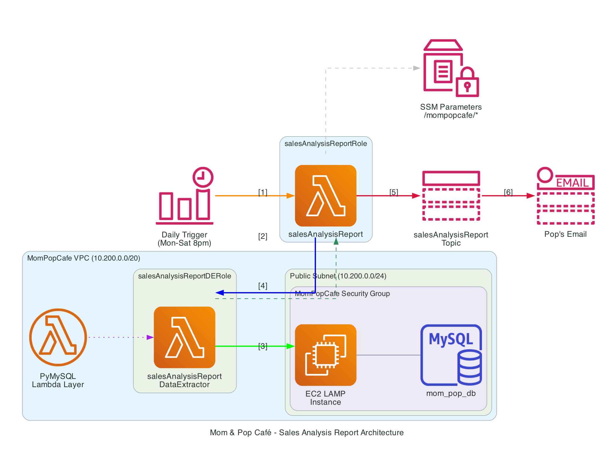

**Data flow:**

1. **EventBridge** triggers the `salesAnalysisReport` Lambda function at 8 PM UTC, Monday through
   Saturday
2. `salesAnalysisReport` reads database connection details from **SSM Parameter Store** and
   invokes the `salesAnalysisReportDataExtractor` Lambda function
3. `salesAnalysisReportDataExtractor` (running inside the VPC with the **PyMySQL layer**) queries
   the MariaDB database (`mom_pop_db`) on the EC2 instance
4. The query result flows back to `salesAnalysisReport`
5. `salesAnalysisReport` formats the report and publishes it to an **SNS topic**
6. SNS sends the report by **email** to all confirmed subscribers

---

## Lab Structure

```text
04-serverless-lambda/
  README.md                 # Lab instructions (this file)
  cfn/
    lab-mompop-cafe.yaml    # CloudFormation template
  lambda/
    pymysql-0.9.3.zip                          # Lambda layer (PyMySQL library)
    salesAnalysisReport.zip                     # Report generator function code
    salesAnalysisReportDataExtractor.zip        # Data extractor function code
  screenshots/              # Visual guides for each task
  scripts/
    cleanup.sh              # Automated resource cleanup
```

---

## Quick Start: Deploy the Infrastructure

Before starting the lab tasks, you must deploy a CloudFormation stack that provisions the
base infrastructure. This section explains what the template creates and walks you through
deploying it from the AWS Console.

### What the Template Creates

The `cfn/lab-mompop-cafe.yaml` template provisions the following resources:

| Resource | Purpose |
| --- | --- |
| **MomPopCafe VPC** (10.200.0.0/20) | Isolated network for the café environment |
| **Public Subnet** (10.200.0.0/24) | Hosts the EC2 instance with a public IP |
| **Private Subnet** (10.200.2.0/23) | Available for private workloads |
| **Internet Gateway** | Provides internet access for the public subnet |
| **NAT Gateway + Elastic IP** | Allows resources in private subnets to reach the internet |
| **MomPopCafeInstance** (t2.micro) | EC2 instance running Apache, PHP, and MariaDB (the café app and database) |
| **MomPopCafeSecurityGroup** | Allows SSH (22) and HTTP (80) inbound — intentionally missing MySQL (3306) |
| **SSM Parameters** | Database connection details under `/mompopcafe/` (created by EC2 UserData) |
| **Route Tables** | Public route table with IGW route, private route table with NAT route |

The EC2 instance runs a UserData script at boot that:

1. Installs Apache, PHP, and MariaDB
2. Downloads and deploys the Mom & Pop Café web application
3. Creates the `mom_pop_db` database with product and order tables
4. Stores the database connection details in SSM Parameter Store

### Deploy the Stack

1. Navigate to **CloudFormation** in the AWS Console
2. Click **Create stack** > **With new resources (standard)**

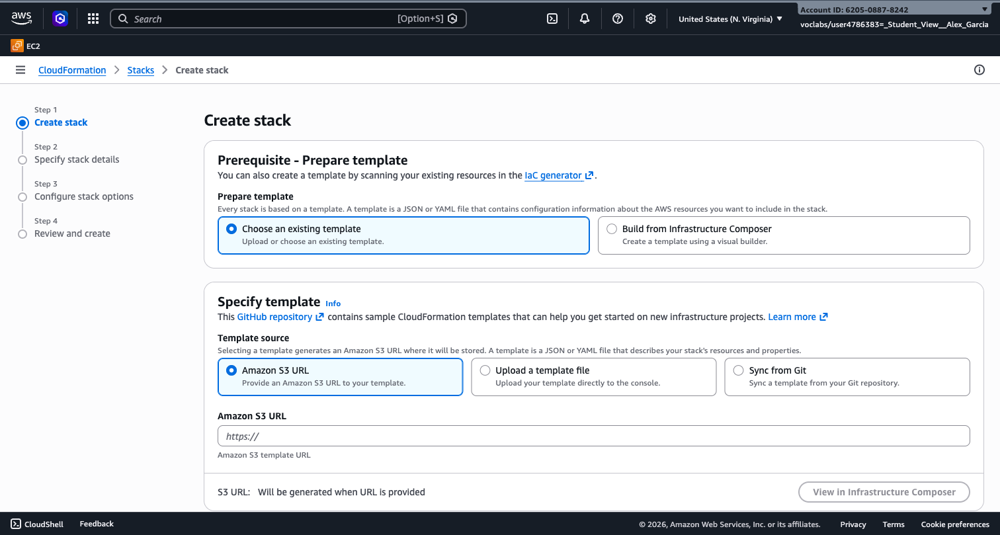

1. Under **Prepare template**, select **Choose an existing template**
2. Under **Specify template**, select **Upload a template file**
3. Click **Choose file** and upload `cfn/lab-mompop-cafe.yaml` from the lab files
4. Click **Next**
5. On the **Specify stack details** page:
   - **Stack name**: `lab04-mompop-cafe`
   - Leave all parameters at their default values
6. Click **Next** through the **Configure stack options** page (no changes needed)
7. On the **Review** page, scroll to the bottom and click **Submit**

The stack takes approximately 5 minutes to create (the NAT Gateway is the slowest resource).
Wait until the status shows **CREATE_COMPLETE**.

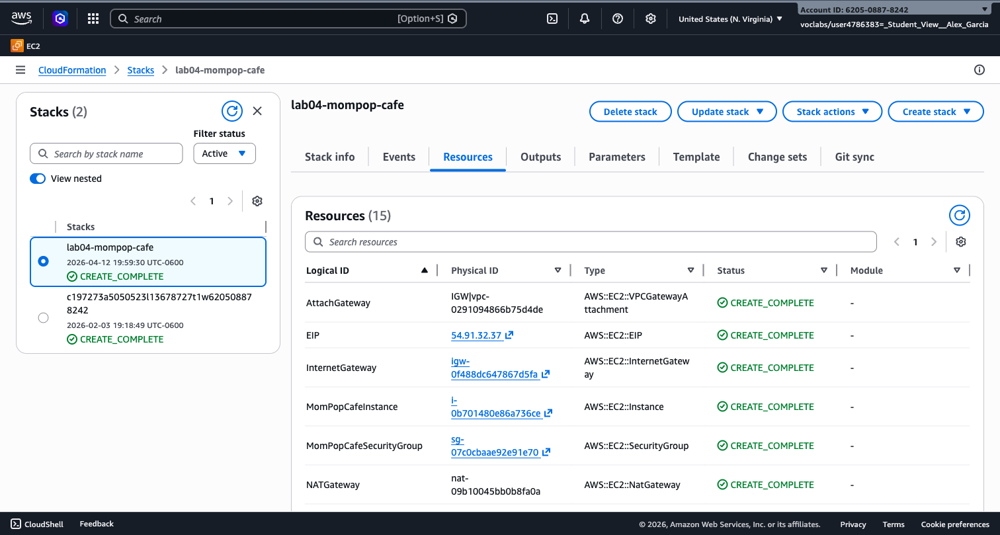

1. Click the **Outputs** tab to find key values you will need during the lab:
    - **MomPopCafePublicIP** -- the public IP of the café EC2 instance
    - **VpcId** -- the VPC where Lambda functions will run
    - **PublicSubnet1Id** -- the subnet for Lambda VPC configuration
    - **MomPopCafeSecurityGroupId** -- the security group to attach to Lambda

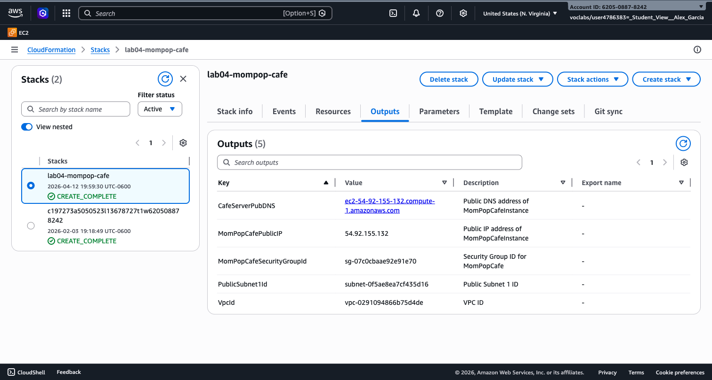

> **Note:** The EC2 UserData script takes an extra minute or two after stack completion to
> finish setting up the database and SSM parameters. Wait until you can access the café
> website at `http://YOUR_INSTANCE_PUBLIC_IP/mompopcafe` before starting Task 1.

---

## Tasks

---

### Task 1: Observe the Pre-configured Environment (~10 min)

The CloudFormation stack created an EC2 instance running MariaDB and stored database connection
details in Systems Manager Parameter Store. In this task you explore the provisioned
resources and identify a security group configuration that will cause problems later.

#### Step 1.1: Review SSM Parameters

1. In the AWS Console, navigate to **Systems Manager** > **Parameter Store**
2. You should see four parameters under the `/mompopcafe/` prefix:
   - `/mompopcafe/dbUrl` -- the private IP of the EC2 database instance
   - `/mompopcafe/dbName` -- the database name (`mom_pop_db`)
   - `/mompopcafe/dbUser` -- the database user
   - `/mompopcafe/dbPassword` -- the database password

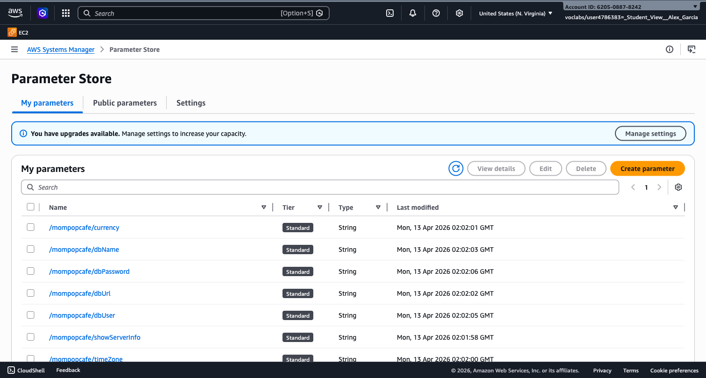

The EC2 instance UserData script created these parameters during boot. Lambda functions
will read these values to connect to the database.

> **Note:** Record the values of all four parameters. You will need them in Task 4 when creating
> a test event.

#### Step 1.2: Inspect the Security Group

1. Navigate to **EC2** > **Security Groups**
2. Find **MomPopCafeSecurityGroup** and click on it
3. Review the **Inbound rules** tab

You should see two inbound rules:

- SSH (port 22) -- for administrative access
- HTTP (port 80) -- for the café web application

> **Question:** Is port 3306 (MySQL) listed in the inbound rules? What might happen when a
> Lambda function running inside the VPC tries to connect to the database on that port?

#### Step 1.3: Open the Café Website

1. Find the public IP of the `MomPopCafeInstance` from the CloudFormation stack outputs
   or the EC2 console
2. Open `http://YOUR_INSTANCE_PUBLIC_IP/mompopcafe` in your browser

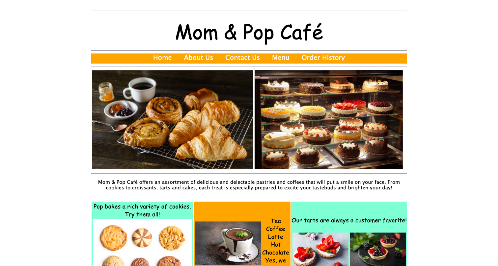

You should see the Mom & Pop Café website. This confirms the EC2 instance is running and the
web application is accessible.

---

### Task 2: Create a Lambda Layer (~10 min)

Lambda layers let you package libraries and other dependencies separately from your function
code. Multiple functions can share the same layer, keeping deployment packages small and
dependencies consistent.

The `salesAnalysisReportDataExtractor` function needs the PyMySQL library to connect to
MariaDB. You will package it as a layer.

#### Step 2.1: Create the Layer

1. Navigate to **Lambda** > **Layers** > **Create layer**
2. Configure:
   - **Name**: `pymysqlLibrary`
   - **Description**: `PyMySQL 0.9.3 library modules`
   - **Upload a .zip file**: select `lambda/pymysql-0.9.3.zip` from the lab files
   - **Compatible runtimes**: Python 3.9
3. Click **Create**

> **Tip:** The ZIP file must follow the folder structure `python/<library>/` for Lambda to
> find the modules at runtime. The provided ZIP already has this structure.

---

### Task 3: Create the Data Extractor Lambda Function (~15 min)

This function connects to the MariaDB database, runs a sales query, and returns the results.
The report generator function you create in Task 6 will invoke it.

#### Step 3.1: Create the Function

1. Navigate to **Lambda** > **Functions** > **Create function**
2. Select **Author from scratch**
3. Configure:
   - **Function name**: `salesAnalysisReportDataExtractor`
   - **Runtime**: Python 3.9
   - **Execution role**: Use an existing role > **LabRole**
4. Click **Create function**

#### Step 3.2: Add the Lambda Layer

1. In the **Function overview** diagram, click the **Layers** box
2. Click **Add a layer**
3. Select **Custom layers** > **pymysqlLibrary** > **Version 1**
4. Click **Add**

#### Step 3.3: Upload the Function Code

1. In the **Code source** section, click **Upload from** > **.zip file**
2. Select `lambda/salesAnalysisReportDataExtractor.zip` from the lab files
3. Click **Save**

#### Step 3.4: Update the Handler

1. Click the **Code** tab > scroll to **Runtime settings** > **Edit**
2. Change **Handler** to: `salesAnalysisReportDataExtractor.lambda_handler`
3. Click **Save**

The handler value follows the format `<filename>.<function_name>`. In this case, Lambda
will load `salesAnalysisReportDataExtractor.py` and call the `lambda_handler` function.

#### Step 3.5: Review the Function Code

After uploading, double-click `salesAnalysisReportDataExtractor.py` in the Code source
panel to view it. Here is the full source:

```python
import boto3
import pymysql
import sys

def lambda_handler(event, context):

    # Retrieve the database connection information from the event input parameter.
    dbUrl = event['dbUrl']
    dbName = event['dbName']
    dbUser = event['dbUser']
    dbPassword = event['dbPassword']

    # Connect to the Mom & Pop database.
    try:
        conn = pymysql.connect(dbUrl, user=dbUser, passwd=dbPassword,
                               db=dbName, cursorclass=pymysql.cursors.DictCursor)
    except pymysql.Error as e:
        print('ERROR: Failed to connect to the Mom & Pop database.')
        print('Error Details: %d %s' % (e.args[0], e.args[1]))
        sys.exit()

    # Execute the sales analysis query.
    with conn.cursor() as cur:
        cur.execute(
            "SELECT c.product_group_number, c.product_group_name, "
            "a.product_id, b.product_name, "
            "CAST(sum(a.quantity) AS int) as quantity "
            "FROM order_item a, product b, product_group c "
            "WHERE b.id = a.product_id AND c.product_group_number = b.product_group "
            "GROUP BY c.product_group_number, a.product_id"
        )
        result = cur.fetchall()

    conn.close()
    return {'statusCode': 200, 'body': result}
```

**Understanding the code:**

| Section | What it does |
| --- | --- |
| `import` statements (lines 1-3) | Run once when the execution environment starts (cold start). Importing `pymysql` here loads it from the Lambda layer. |
| `def lambda_handler(event, context)` | The entry point Lambda calls on every invocation. `event` contains the input data (database connection details). `context` provides runtime metadata (request ID, time remaining, etc.). |
| `event['dbUrl']`, etc. | Extracts database connection parameters from the input event JSON. The caller must provide these fields. |
| `pymysql.connect(...)` | Opens a TCP connection to the MariaDB database. This is why the function needs VPC access and port 3306 must be open in the security group. |
| `cur.execute(...)` | Runs a SQL query that aggregates order quantities by product group and product name. |
| `return {...}` | Returns a JSON response with HTTP status code 200 and the query results in `body`. |

> **Key insight:** Everything *outside* `lambda_handler` (the `import` statements) runs
> only once during a cold start and stays in memory for subsequent invocations. Everything
> *inside* `lambda_handler` runs on every invocation. Expensive setup (database connection
> pools, SDK clients) should go outside the handler when possible for better performance.
>
> **From the AWS documentation:**
> *"Initialize SDK clients and database connections outside of the function handler, and
> cache static assets locally in the `/tmp` directory. Subsequent invocations processed by
> the same instance of your function can reuse these resources. This saves cost by reducing
> function run time."*
>
> Source: [Best practices for working with AWS Lambda functions](https://docs.aws.amazon.com/lambda/latest/dg/best-practices.html)
>
> In this lab, the database connection is created inside the handler on every invocation.
> In a production application, you would move `pymysql.connect(...)` outside the handler
> so the connection persists across invocations of the same execution environment:
>
> ```python
> # PRODUCTION PATTERN: connection created once, reused across invocations
> conn = pymysql.connect(...)  # outside the handler
>
> def lambda_handler(event, context):
>     with conn.cursor() as cur:
>         cur.execute(...)  # reuses the existing connection
> ```

#### Step 3.6: Configure VPC Connectivity

The function must run inside the VPC to reach the MariaDB database on its private IP.

1. Click the **Configuration** tab > **VPC** > **Edit**
2. Configure:
   - **VPC**: MomPopCafe VPC
   - **Subnets**: MomPopCafe Public Subnet 1
   - **Security groups**: MomPopCafeSecurityGroup
3. Click **Save**

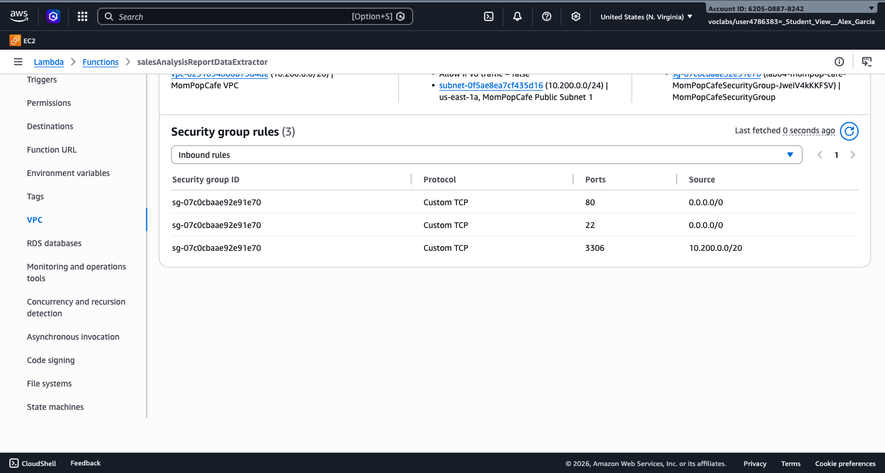

#### Step 3.7: Increase the Timeout

The default Lambda timeout is 3 seconds, which is too short for a database query on a cold
start.

1. **Configuration** > **General configuration** > **Edit**
2. Set **Timeout** to **30 seconds**
3. Click **Save**

---

### Task 4: Test and Troubleshoot the Data Extractor (~15 min)

#### Step 4.1: Create a Test Event

1. Click the **Test** tab
2. Create a new test event named `SARDETestEvent`
3. Replace the default JSON with the SSM parameter values you recorded in Task 1:

```json
{
  "dbUrl": "YOUR_DB_URL",
  "dbName": "YOUR_DB_NAME",
  "dbUser": "YOUR_DB_USER",
  "dbPassword": "YOUR_DB_PASSWORD"
}
```

Replace each `YOUR_*` placeholder with the actual value from Parameter Store.

1. Click **Save**

#### Step 4.2: Run the First Test -- Expected Failure

1. Click **Test**
2. **Expected result: the function fails** with a connection timeout error

The execution result shows a `Task timed out after 30.00 seconds` or a connection error. The
Lambda function is running inside the VPC and trying to reach the MariaDB database on port
3306, but the security group does not allow inbound traffic on that port.

Open **CloudWatch Logs** (Monitor tab > View CloudWatch logs) to see the timeout details.

> **Question:** What port does MySQL use by default? Is that port allowed in the security
> group's inbound rules? How would you fix this?

#### Step 4.3: Fix the Security Group

1. Navigate to **EC2** > **Security Groups** > **MomPopCafeSecurityGroup**
2. Click **Edit inbound rules** > **Add rule**
3. Configure:
   - **Type**: MySQL/Aurora
   - **Port range**: 3306
   - **Source**: Custom -- `10.200.0.0/20` (the VPC CIDR)
4. Click **Save rules**

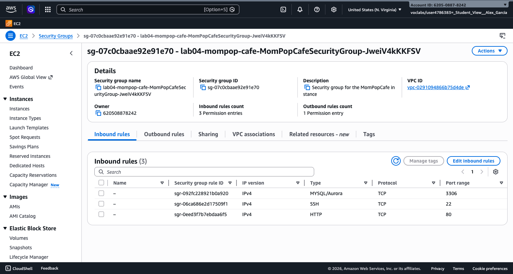

#### Step 4.4: Retest -- Expected Success (Empty)

1. Return to the Lambda function and click **Test** again
2. **Expected result: success** with an empty body:

```json
{
  "statusCode": 200,
  "body": []
}
```

The function connects to the database successfully, but there are no orders yet.

#### Step 4.5: Place an Order and Retest

1. Go back to the café website at `http://YOUR_INSTANCE_PUBLIC_IP/mompopcafe`
2. Click **Menu** and place one or more orders

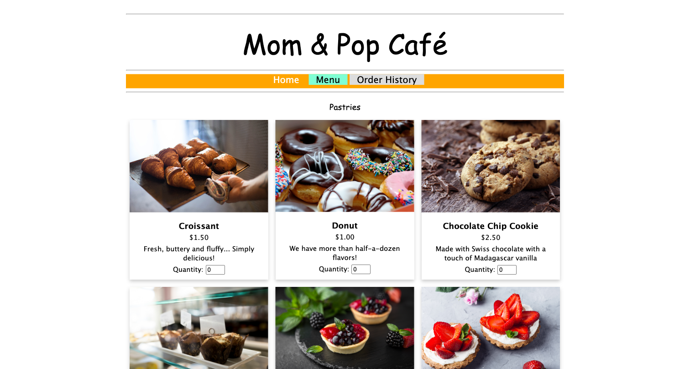

1. Return to Lambda and click **Test** again
2. **Expected result: success** with order data:

```json
{
  "statusCode": 200,
  "body": [
    {
      "product_group_number": 1,
      "product_group_name": "Desserts",
      "product_id": 1,
      "product_name": "Chocolate cake  slice",
      "quantity": 1
    }
  ]
}
```

The exact items depend on what you ordered. The function is now working end to end.

---

### Task 5: Configure SNS Notifications (~10 min)

#### Step 5.1: Create an SNS Topic

1. Navigate to **SNS** > **Topics** > **Create topic**
2. Configure:
   - **Type**: Standard
   - **Name**: `salesAnalysisReportTopic`
   - **Display name**: `SARTopic`
3. Click **Create topic**

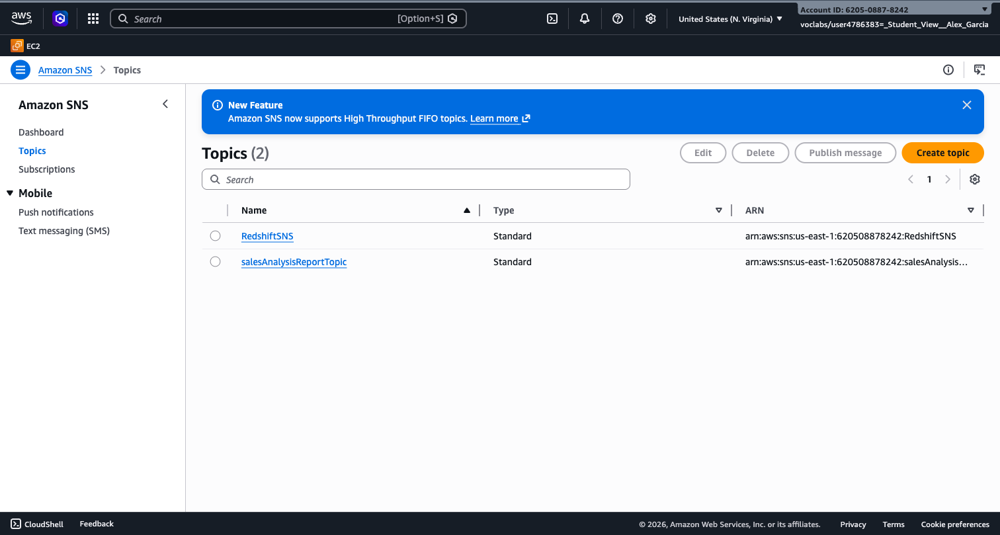

#### Step 5.2: Record the Topic ARN

Copy the **Topic ARN** displayed at the top of the topic detail page. You will need it in
Task 6. It looks like:

```text
arn:aws:sns:us-east-1:YOUR_AWS_ACCOUNT_ID:salesAnalysisReportTopic
```

#### Step 5.3: Create an Email Subscription

1. Click **Create subscription**
2. Configure:
   - **Protocol**: Email
   - **Endpoint**: your email address (e.g., `studentname@iteso.mx`)
3. Click **Create subscription**

#### Step 5.4: Confirm the Subscription

1. Check your email inbox for a message from **AWS Notifications**
2. Click the **Confirm subscription** link in the email

> **Tip:** Check your spam or junk folder if you do not see the email within a few minutes.

---

### Task 6: Create the Sales Analysis Report Function (~15 min)

This function orchestrates the entire report: it invokes the data extractor, formats the
results, and publishes the report through SNS.

#### Step 6.1: Create the Function

1. Navigate to **Lambda** > **Functions** > **Create function**
2. Select **Author from scratch**
3. Configure:
   - **Function name**: `salesAnalysisReport`
   - **Runtime**: Python 3.9
   - **Execution role**: Use an existing role > **LabRole**
4. Click **Create function**

#### Step 6.2: Upload the Function Code

1. In the **Code source** section, click **Upload from** > **.zip file**
2. Select `lambda/salesAnalysisReport.zip` from the lab files
3. Click **Save**

#### Step 6.3: Update the Handler

1. Click **Runtime settings** > **Edit**
2. Change **Handler** to: `salesAnalysisReport.lambda_handler`
3. Click **Save**

#### Step 6.4: Review the Function Code

Double-click `salesAnalysisReport.py` in the Code source panel. Here is the full source:

```python
import boto3
import os
import json
import io
import datetime

def setTabsFor(productName):
    nameLength = len(productName)
    if nameLength < 20:
        tabs = '\t\t\t'
    elif 20 <= nameLength <= 37:
        tabs = '\t\t'
    else:
        tabs = '\t'
    return tabs

def lambda_handler(event, context):

    # Read configuration from environment variables.
    TOPIC_ARN = os.environ['topicARN']
    FUNCTION_REGION = os.environ['AWS_REGION']

    # Extract the topic region from the ARN.
    arnParts = TOPIC_ARN.split(':')
    TOPIC_REGION = arnParts[3]

    # Retrieve database connection details from SSM Parameter Store.
    ssmClient = boto3.client('ssm', region_name=FUNCTION_REGION)

    dbUrl = ssmClient.get_parameter(Name='/mompopcafe/dbUrl')['Parameter']['Value']
    dbName = ssmClient.get_parameter(Name='/mompopcafe/dbName')['Parameter']['Value']
    dbUser = ssmClient.get_parameter(Name='/mompopcafe/dbUser')['Parameter']['Value']
    dbPassword = ssmClient.get_parameter(
        Name='/mompopcafe/dbPassword')['Parameter']['Value']

    # Invoke the data extractor Lambda function.
    lambdaClient = boto3.client('lambda', region_name=FUNCTION_REGION)
    dbParameters = {
        "dbUrl": dbUrl, "dbName": dbName,
        "dbUser": dbUser, "dbPassword": dbPassword
    }
    response = lambdaClient.invoke(
        FunctionName='salesAnalysisReportDataExtractor',
        InvocationType='RequestResponse',
        Payload=json.dumps(dbParameters)
    )

    # Parse the response from the data extractor.
    reportDataBytes = response['Payload'].read()
    reportDataString = str(reportDataBytes, encoding='utf-8')
    reportData = json.loads(reportDataString)
    reportDataBody = reportData["body"]

    # Format the report message.
    snsClient = boto3.client('sns', region_name=TOPIC_REGION)
    message = io.StringIO()
    message.write('Sales Analysis Report'.center(80) + '\n')
    today = 'Date: ' + str(datetime.datetime.now().strftime('%Y-%m-%d'))
    message.write(today.center(80) + '\n')

    if len(reportDataBody) > 0:
        previousProductGroupNumber = -1
        for productRow in reportDataBody:
            if productRow['product_group_number'] != previousProductGroupNumber:
                message.write('\nProduct Group: ' + productRow['product_group_name'])
                message.write('\n\nItem Name'.center(40) + '\t\t\tQuantity\n')
                message.write('*********'.center(40) + '\t\t\t********\n')
                previousProductGroupNumber = productRow['product_group_number']
            productName = productRow['product_name']
            tabs = setTabsFor(productName)
            message.write(productName.center(40) + tabs + str(productRow['quantity']).center(5) + '\n')
    else:
        message.write('\n' + 'There were no orders today.'.center(80))

    # Publish the report to the SNS topic.
    snsClient.publish(
        TopicArn=TOPIC_ARN,
        Subject='Daily Sales Analysis Report',
        Message=message.getvalue()
    )

    return {'statusCode': 200, 'body': json.dumps('Sale Analysis Report sent.')}
```

**Understanding the code:**

| Section | What it does |
| --- | --- |
| `import` statements (lines 1-5) | Loaded once during cold start. `boto3` provides AWS SDK clients, `os` reads environment variables, `io` builds the report string. |
| `setTabsFor()` helper | A utility function outside the handler that formats column alignment in the email report. Runs in the same execution environment. |
| `os.environ['topicARN']` | Reads the SNS topic ARN from the environment variable you configure in Step 6.5. This is how Lambda functions receive configuration without hardcoding values. |
| `os.environ['AWS_REGION']` | A built-in Lambda environment variable that contains the region where the function runs (e.g., `us-east-1`). |
| `ssmClient.get_parameter(...)` | Reads database connection details from SSM Parameter Store at runtime instead of hardcoding them. This is a security best practice. |
| `lambdaClient.invoke(...)` | Calls the `salesAnalysisReportDataExtractor` function synchronously (`RequestResponse`). This is a function-to-function invocation pattern. |
| `snsClient.publish(...)` | Sends the formatted report to the SNS topic, which delivers it to all confirmed email subscribers. |
| `return {...}` | Returns a success response. The caller receives confirmation that the report was sent. |

> **Key insight:** This function acts as an **orchestrator**. It does not access the database
> directly — instead it reads configuration from SSM, delegates the database query to another
> Lambda function, formats the result, and publishes it through SNS. This separation of
> concerns keeps each function focused on a single responsibility.
>
> Notice that `boto3` clients are created *inside* the handler. In production code, you would
> move these outside the handler so they persist across invocations and avoid recreating them
> on every call.

#### Step 6.5: Configure the Environment Variable

1. Click the **Configuration** tab > **Environment variables** > **Edit**
2. Click **Add environment variable**:
   - **Key**: `topicARN`
   - **Value**: paste the SNS topic ARN from Task 5
3. Click **Save**

#### Step 6.6: Increase the Timeout

1. **Configuration** > **General configuration** > **Edit**
2. Set **Timeout** to **30 seconds**
3. Click **Save**

#### Step 6.7: Test the Function

1. Click the **Test** tab
2. Create a new test event named `SARTestEvent` with the default `{}` payload
3. Click **Test**
4. **Expected result: success**:

```json
{
  "statusCode": 200,
  "body": "\"Sale Analysis Report sent.\""
}
```

> **Note:** The function returns "Sale Analysis Report" (without the "s") in the response
> body. This is a minor typo in the original function code. The email subject line correctly
> reads "Daily Sales Analysis Report".

#### Step 6.8: Verify the Email

Check your email inbox. You should receive a **Daily Sales Analysis Report** from
**SARTopic** containing a summary of the café orders.

---

### Task 7: Schedule with EventBridge (~10 min)

#### Step 7.1: Add an EventBridge Trigger

1. In the `salesAnalysisReport` function overview, click **Add trigger**
2. Select **EventBridge (CloudWatch Events)**
3. Configure:
   - **Create a new rule**
   - **Rule name**: `salesAnalysisReportDailyTrigger`
   - **Description**: `Triggers report generation on a daily basis`
   - **Rule type**: Schedule expression
   - **Schedule expression**: `cron(0 20 ? * MON-SAT *)`
4. Click **Add**

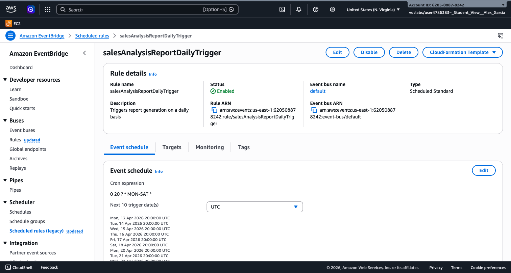

This cron expression triggers the function at 8:00 PM UTC, Monday through Saturday.

> **Tip:** Cron expressions in EventBridge use the UTC time zone. Adjust accordingly for
> your local time.
>
> **Challenge:** For immediate testing, change the cron expression to trigger 5 minutes from
> now. Verify that you receive the sales report email at the scheduled time, then restore the
> original expression.

---

## Cleanup

Delete all resources in this order to avoid dependency errors:

1. **EventBridge rule** -- In the `salesAnalysisReport` function, go to
   **Configuration** > **Triggers** and delete the EventBridge rule
2. **Lambda functions** -- Delete `salesAnalysisReport` and
   `salesAnalysisReportDataExtractor`
3. **Lambda layer** -- Delete `pymysqlLibrary` (Lambda > Layers)
4. **SNS topic and subscriptions** -- Delete the `salesAnalysisReportTopic` topic
   (this also removes its subscriptions)
5. **CloudFormation stack** -- Navigate to **CloudFormation** > **Stacks**, select
   `lab04-mompop-cafe`, and click **Delete**. Wait for the stack to reach
   `DELETE_COMPLETE`. This removes the VPC, EC2 instance, NAT gateway, and all
   networking resources.

---

## Troubleshooting

| Issue | Cause | Solution |
| --- | --- | --- |
| Lambda times out connecting to database | Security group missing port 3306 | Add MySQL/Aurora (3306) inbound rule from VPC CIDR `10.200.0.0/20` |
| Lambda returns empty body `[]` | No orders in the database | Place orders on the café website first |
| "Unable to import module" error | Layer not attached or wrong handler path | Verify you attached the layer and the handler matches the file/function name |
| Lambda cannot reach SSM or SNS | Lambda in VPC without internet access | Verify the NAT gateway exists and the route table has the correct configuration |
| SNS email not received | Subscription not confirmed | Check spam folder and click the confirmation link |
| `salesAnalysisReport` timeout | First invocation cold start | Increase timeout to 30 seconds and retry |
| "Task timed out after 3.00 seconds" | Default 3-second timeout too short | Increase to 30 seconds in General configuration |

---

## Key Concepts

| Concept | Description |
| --- | --- |
| Lambda Execution Role | IAM role assumed by the function at runtime, defining what AWS services it can access |
| Lambda Layer | Reusable code or library package shared across multiple functions |
| VPC-Connected Lambda | Function with an ENI in a VPC subnet, enabling access to private resources |
| Cold Start | Initial setup time when Lambda creates a new execution environment for the first invocation |
| Environment Variables | Key-value pairs injected at runtime for configuration without code changes |
| EventBridge Rule | Scheduled or event-pattern trigger that invokes AWS services on a defined cadence |
| Cron Expression | Schedule syntax: `cron(minutes hours day-of-month month day-of-week year)` |
| SNS Topic | Pub/sub messaging channel that fans out notifications to all subscribers |

---

## Conclusions

This lab demonstrated core principles of serverless architecture on AWS:

- **Lambda as event-driven compute** -- Functions run only when triggered, with no servers to
  manage. The two-function design (report generator invoking data extractor) shows how to
  decompose work into small, focused units.
- **VPC connectivity requires deliberate configuration** -- Placing a Lambda function inside a
  VPC is necessary to reach private resources like a database, but it also introduces
  networking constraints. Security groups, subnets, and NAT gateways must all align.
- **Troubleshooting is a core skill** -- The intentional security group gap reinforced a
  systematic debugging approach: check CloudWatch logs, identify the failure point, trace the
  network path, and fix the root cause.
- **Managed services reduce operational burden** -- SNS handles email delivery, EventBridge
  handles scheduling, and CloudWatch handles logging. You wrote no infrastructure code for any
  of these capabilities.

---

## Next Steps

- **API Gateway + Lambda** -- Expose Lambda functions as REST APIs for synchronous request
  handling
- **AWS Step Functions** -- Orchestrate multi-step workflows with built-in retry logic and
  error handling
- **AWS SAM / CDK** -- Define serverless applications as infrastructure as code instead of
  manual console configuration
- **Next course module** -- Continue to the next lab in the course sequence
